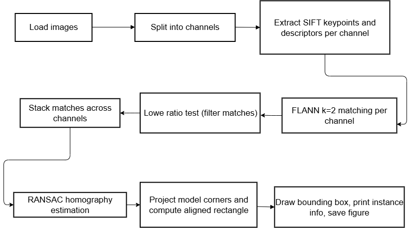
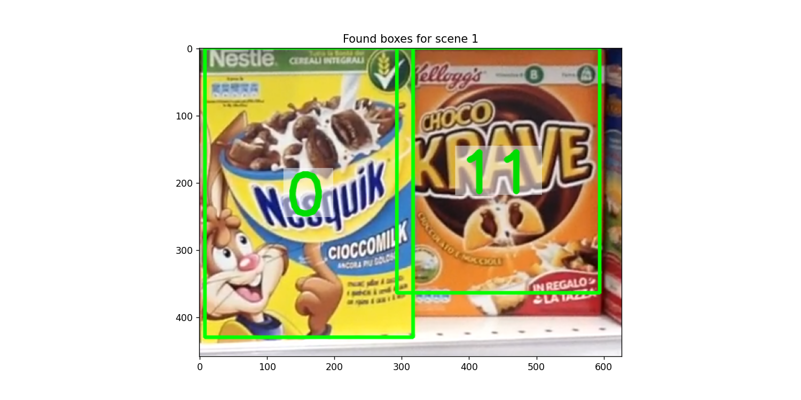
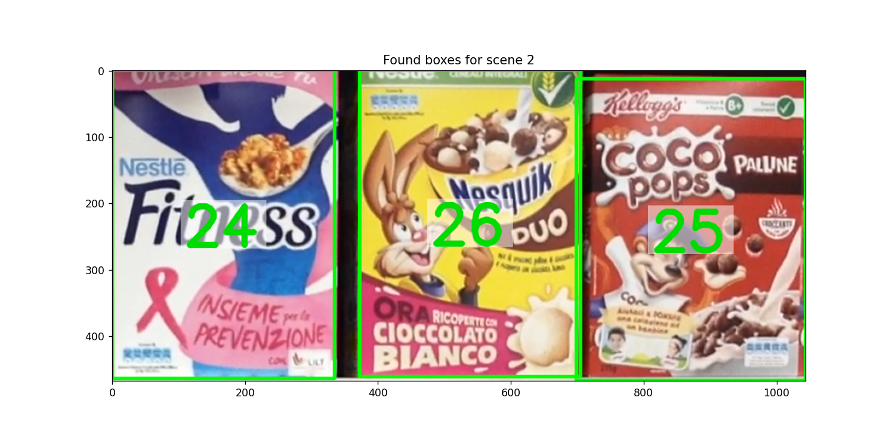
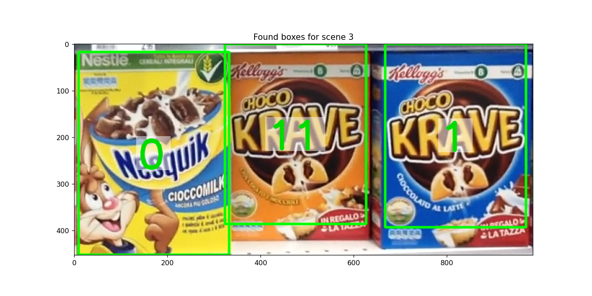
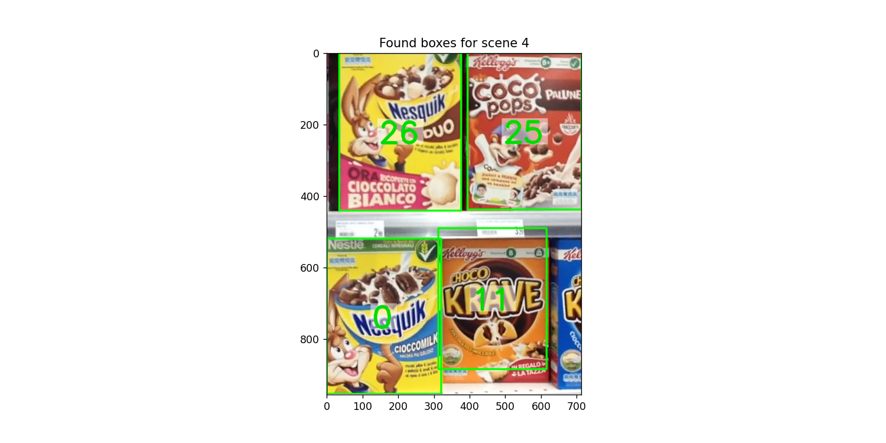
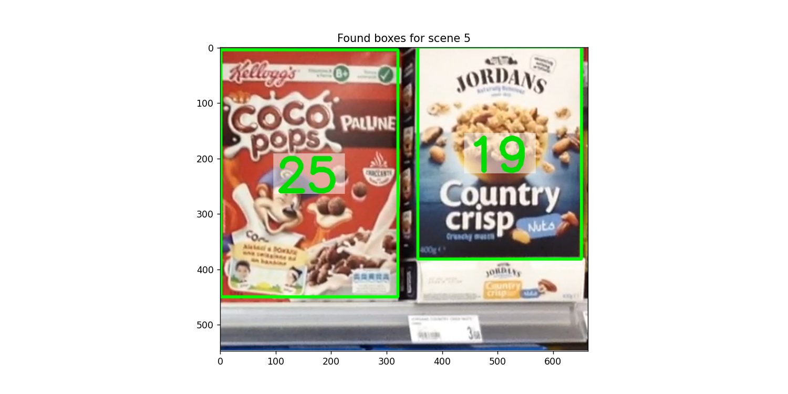

## Introduction

<!-- ::: note
Lorem ipsum dolor sit amet, consectetur adipiscing elit. Nam aliquet libero
quis lectus elementum fermentum.

Fusce aliquet augue sapien, non efficitur mi ornare sed. Morbi at dictum
felis. Pellentesque tortor lacus, semper et neque vitae, egestas commodo nisl.
:::


::: important
Lorem ipsum dolor sit amet, consectetur adipiscing elit. Nam aliquet libero
quis lectus elementum fermentum.

Fusce aliquet augue sapien, non efficitur mi ornare sed. Morbi at dictum
felis. Pellentesque tortor lacus, semper et neque vitae, egestas commodo nisl.
::: -->


This project implements a single-instance product detector that localizes cereal boxes in shelf images using SIFT features computed independently on the RGB channels, FLANN matching with Lowe's ratio test, and homography estimation with RANSAC. The notebook `step_A.ipynb` contains the runnable pipeline; this report highlights the workflow, key data structures, concise results (extracted from the notebook output), and a short conclusion.

## Project overview

The project consists of a pipeline for detecting products on store shelves using computer vision techniques. The main steps include loading images, extracting features, matching them, and estimating the position of products in the scene.


The processing pipeline is compactly represented below. 



## Approach and key data structures

The approach can be summarized as follows: compute per-channel SIFT features, match per-channel with FLANN + ratio test, stack good matches to compute a robust homography, then derive an axis-aligned bounding rectangle from the projected model corners.

Data structures (representative):

```python
keypoints_dict = {
  image_id: {
    'R': [cv2.KeyPoint, ...],
    'G': [cv2.KeyPoint, ...],
    'B': [cv2.KeyPoint, ...]
  }
}

descriptors_dict = {
  image_id: {
    'R': np.ndarray(shape=(N_R, 128), dtype=np.float32),
    'G': np.ndarray(shape=(N_G, 128), dtype=np.float32),
    'B': np.ndarray(shape=(N_B, 128), dtype=np.float32)
  }
}

matches_per_channel = {
  'R': [cv2.DMatch, ...],
  'G': [cv2.DMatch, ...],
  'B': [cv2.DMatch, ...]
}

# homography: `3x3` NumPy array
# projected corners: `4x1x2` `float32` array
```

Notes: model images were resized consistently before feature extraction; features are computed once and reused across model-vs-scene comparisons.

## Results (parsed from notebook output)

Below are the detections produced by `main(min_count=75, ...)` for the five scenes. For each scene I include only products that had 1 instance (the single-instance constraint). The instance lines are verbatim from the notebook prints. The saved visualization for each scene is included below the textual results.

- Scene 1 (`figures/scene_1_bounding_boxes.png`)

  - Product `0` - 1 instance found:
    - Instance 1 {position: (162, 216), width: 309px, height: 432px}

  - Product `11` - 1 instance found:
    - Instance 1 {position: (444, 180), width: 299px, height: 359px}

  

- Scene 2 (`figures/scene_2_bounding_boxes.png`)

  - Product `24` - 1 instance found:
    - Instance 1 {position: (167, 232), width: 334px, height: 464px}

  - Product `25` - 1 instance found:
    - Instance 1 {position: (878, 232), width: 311px, height: 440px}

  - Product `26` - 1 instance found:
    - Instance 1 {position: (538, 230), width: 332px, height: 461px}

  

- Scene 3 (`figures/scene_3_bounding_boxes.png`)

  - Product `0` - 1 instance found:
    - Instance 1 {position: (172, 234), width: 323px, height: 436px}

  - Product `1` - 1 instance found:
    - Instance 1 {position: (816, 197), width: 303px, height: 394px}

  - Product `11` - 1 instance found:
    - Instance 1 {position: (476, 192), width: 303px, height: 385px}

  

- Scene 4 (`figures/scene_4_bounding_boxes.png`)

  - Product `0` - 1 instance found:
    - Instance 1 {position: (160, 738), width: 320px, height: 435px}

  - Product `11` - 1 instance found:
    - Instance 1 {position: (463, 690), width: 304px, height: 396px}

  - Product `25` - 1 instance found:
    - Instance 1 {position: (554, 216), width: 318px, height: 433px}

  - Product `26` - 1 instance found:
    - Instance 1 {position: (206, 221), width: 341px, height: 442px}

  

- Scene 5 (`figures/scene_5_bounding_boxes.png`)

  - Product `19` - 1 instance found:
    - Instance 1 {position: (504, 192), width: 295px, height: 383px}

  - Product `25` - 1 instance found:
    - Instance 1 {position: (161, 228), width: 320px, height: 445px}

  

## Conclusions

Summary: the SIFT-per-channel + FLANN + RANSAC pipeline reliably localizes single instances of the provided product models in the five test scenes. The saved `figures/scene_*.png` images contain the annotated outputs used to verify detections. 

Next steps: extend to multi-instance detection, add quantitative metrics (precision/recall), or move to a learned detector for greater robustness under heavy occlusion.
