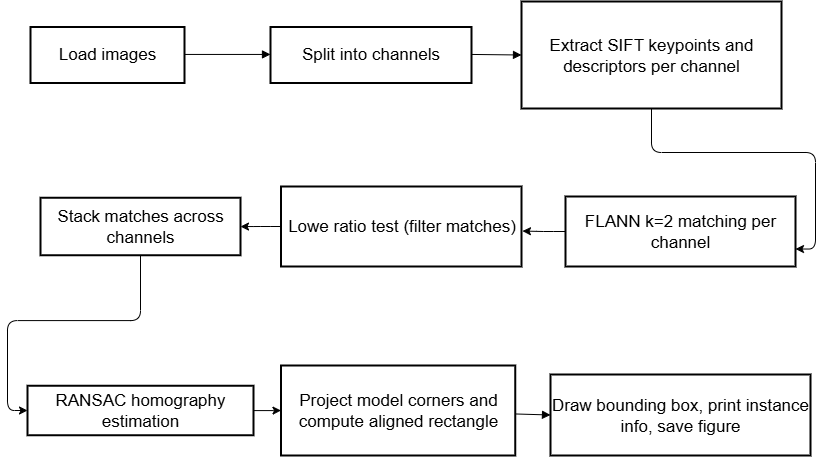
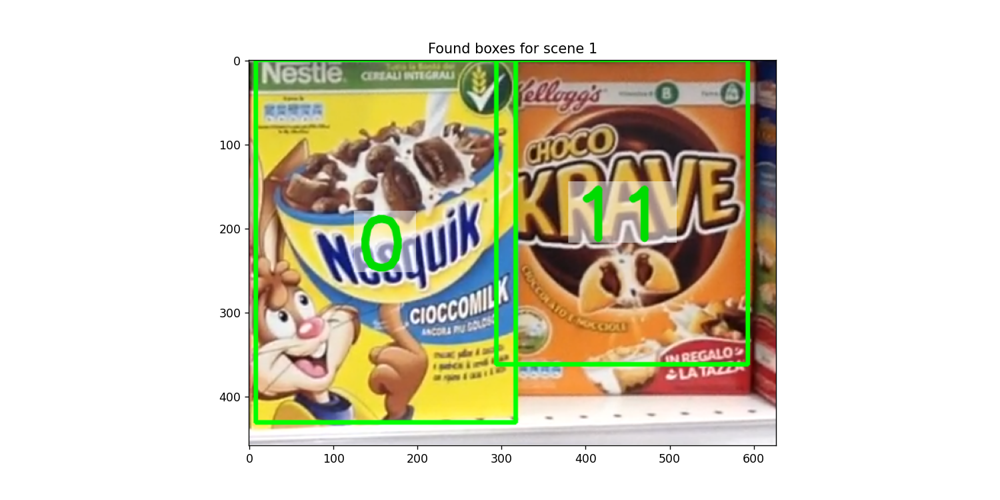
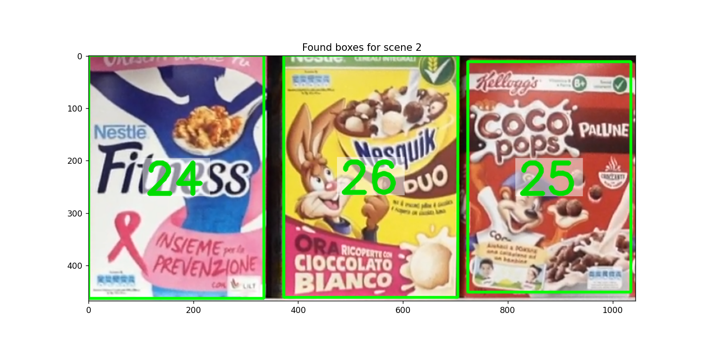
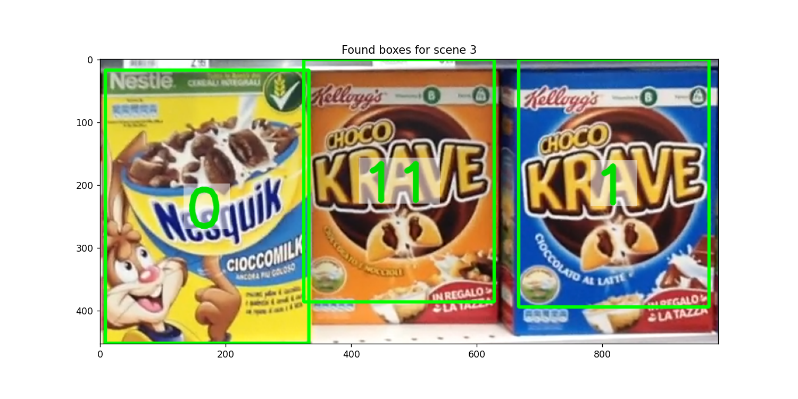
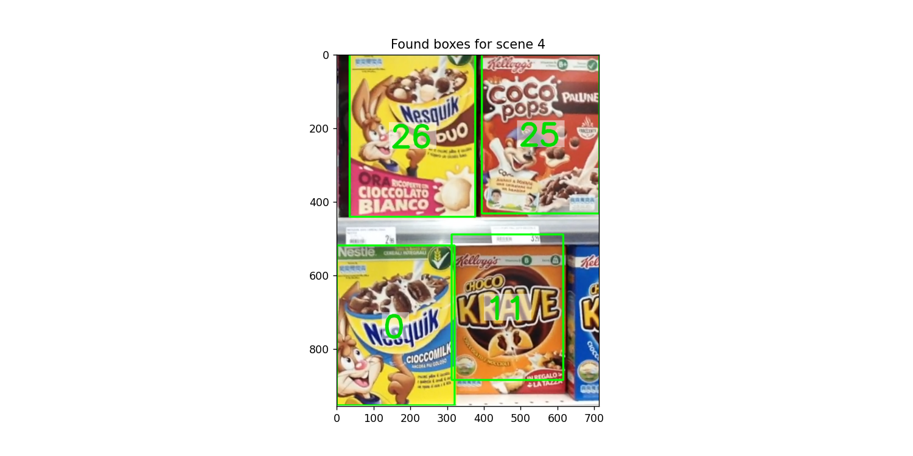
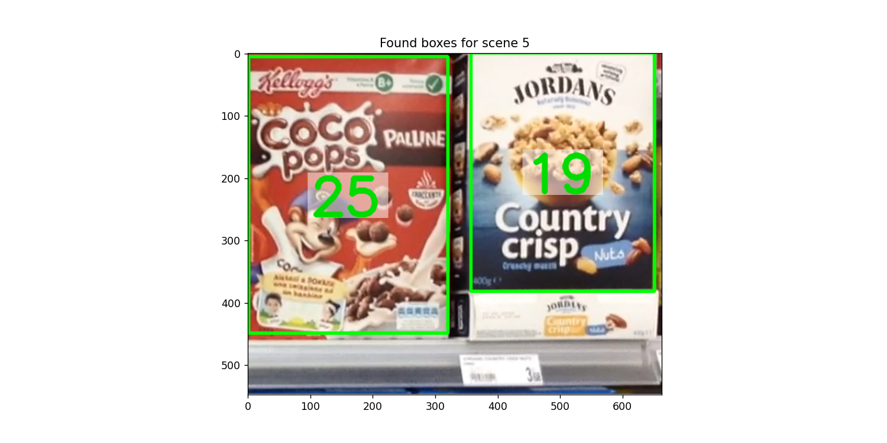

## Project description

## Step A

### Task Introduction

<!-- ::: note
Lorem ipsum dolor sit amet, consectetur adipiscing elit. Nam aliquet libero
quis lectus elementum fermentum.

Fusce aliquet augue sapien, non efficitur mi ornare sed. Morbi at dictum
felis. Pellentesque tortor lacus, semper et neque vitae, egestas commodo nisl.
:::

::: important
Lorem ipsum dolor sit amet, consectetur adipiscing elit. Nam aliquet libero
quis lectus elementum fermentum.

Fusce aliquet augue sapien, non efficitur mi ornare sed. Morbi at dictum
felis. Pellentesque tortor lacus, semper et neque vitae, egestas commodo nisl.
::: -->

The task A requires to implement a single-instance product detector that localizes cereal boxes in shelf images.

The task was attempted using SIFT features, computed independently on the RGB channels, FLANN matching with Lowe's ratio test, and homography estimation with RANSAC. The notebook `step_A.ipynb` contains the runnable pipeline; this report highlights the chosen methodology and implementation details, results and a short conclusion. For Step A, all models were correctly recognized.


### Task overview

The project consists of a pipeline for detecting products on store shelves using computer vision techniques. The main steps include loading images, extracting features and descriptors, matching descriptors between model and scene images and estimating the position of products in the scene.

The processing pipeline is compactly represented below.



### Methodology and Implementation Details

This section gives a deeper explanation of the pipeline (both theoretical motivations and implementation details).

#### High-level pipeline

1. **Per-channel feature extraction:** Each model and scene image is split into R/G/B channels (function `create_channel_dict`) and SIFT keypoints/descriptors are computed independently on each channel using `cv2.SIFT_create()` inside `extract_features_dict`. The result is two nested dictionaries (`keypoints_dict` and `descriptors_dict`) indexed by image id and channel. 

2. **Channel-wise matching:** For each model-vs-scene pair, descriptors from color channel `c` of the model are matched against descriptors from channel `c` of the scene using a FLANN approximate k-NN search (`k=2`). The reason for `k=2` is to enable Lowe's ratio test which requires the nearest and second-nearest neighbors. The matching is implemented in the `compute_matches_dict_single` function.

3. **Ratio-based filtering:** The `filter_matches` function applies Lowe's ratio test, which is expressed as the formula $\text{dist}_1 < 0.7 \times \text{dist}_2$. Here, $\text{dist}_1$ represents the distance to the nearest neighbor, and $\text{dist}_2$ represents the distance to the second-nearest neighbor in the descriptor space. This test removes ambiguous matches where the nearest neighbor is not sufficiently better than the second nearest. This filtering is applied inside the `compute_good_matches_dict_single` function, which returns only the best matches per channel.

4. **Aggregation and geometric verification:** The filtered 'good' matches from the three channels are stacked into an  array of source and an array of destination points. These stacked correspondences feed `cv2.findHomography(..., cv2.RANSAC, ransacReprojThreshold=3)`. RANSAC rejects outlier matches and returns a robust 3×3 homography matrix that maps model coordinates to the scene.

5. **Projection and bounding rectangle:** Model corners are projected into the scene with `cv2.perspectiveTransform`. To produce a stable, axis-aligned bounding box, the notebook calls `compute_aligned_rectangle` (in `utils/bounding_box_utils.py`), which constrains the rectangle to image bounds and computes width, height, and center. 

All of these steps are orchestrated in the `main` function, which iterates over all scene and model images, applies the above steps, and saves annotated output images with bounding boxes. 

The main function calls at each iteration the `object_retrieve` function, which encapsulates steps 2-5 for a single model-vs-scene pair. and  


#### SIFT on multiple channels

- **Color-preserving detection**: converting to grayscale discards chromatic edges and contrast that can be crucial for brand logos or colored patterns. Computing SIFT independently on R/G/B preserves such color-specific details.
- **Complementary matches**: features that are weak in one channel may be strong in another; stacking channel-wise good matches increases the chance of obtaining enough inliers for RANSAC while still allowing geometric pruning of false matches.
- **Practical trade-offs**: processing three channels multiplies descriptor storage and matching work by $\approx\times3$. The notebook mitigates false positives by applying the Lowe ratio test per-channel and then applying RANSAC on stacked matches.

#### Main implementation components

- SIFT: instantiated via `sift = cv2.SIFT_create()` and applied per-channel in `extract_features_dict`. Model images were resized to a common shape (`180x240`) before feature extraction to reduce inter-model scale variability. This normalization stabilizes keypoint distribution and simplifies numeric thresholds like `min_count`.

- FLANN: the matcher is built in `initialize_flann()` with KD-tree (`trees=5`) and search `checks=50` (these parameters are tuned for a balance between speed and accuracy). FLANN's `knnMatch(..., k=2)` returns pairs used by Lowe's ratio. It is particularly efficient for high-dimensional descriptor matching, leveraging approximate nearest neighbor search to balance speed and accuracy.

- Lowe ratio test: implemented in `filter_matches` with threshold `0.7` (a standard value; higher values are stricter). The function returns only the best matches per channel.

- RANSAC/Homography: `compute_homography` stacks matched keypoint coordinates and calls `cv2.findHomography(..., cv2.RANSAC, ransacReprojThreshold=3)` to estimate a robust transformation. The reprojection threshold (`3` px) controls inlier acceptance.

```{.python .listing caption="Representative In-Memory Structures"}
keypoints_dict = {
    model_indexes[0]: {
        'R': [<cv2.KeyPoint 0x1>, <cv2.KeyPoint 0x2>],
        'G': [<cv2.KeyPoint 0x3>, <cv2.KeyPoint 0x4>],
        'B': [<cv2.KeyPoint 0x5>, <cv2.KeyPoint 0x6>]
    },
    model_indexes[1]: {
        'R': [<cv2.KeyPoint 0x7>, <cv2.KeyPoint 0x8>],
        'G': [<cv2.KeyPoint 0x9>, <cv2.KeyPoint 0x10>],
        'B': [<cv2.KeyPoint 0x11>, <cv2.KeyPoint 0x12>]
    }
    # ... more keys for each image id
}

# structure of descriptors_dict is similar to keypoints_dict, the inner dictionaries values are numpy arrays instead of list of keypoints

```

::: note
model images were resized to a common shape (`180x240`) before feature extraction to reduce inter-model scale variability. Although SIFT is scale-invariant theoretically, in practical template matching scenarios large differences in template sizes lead to inconsistent keypoint counts, differing keypoint scale distributions, and mismatched descriptor sampling densities. Normalizing templates to a common scale stabilizes the number and distribution of keypoints per model, simplifies the choice of numeric thresholds (e.g. `min_count`), and reduces false negatives caused by extreme template-to-scene scale mismatches. The trade-off is that very large scale variations in the scene may require multi-scale search or pyramid matching, but for a controlled, single-instance template setup this normalization improves consistency and reproducibility.
:::

Suggested figures, tables and additional content to add for rigor

- Per-channel keypoint panels: for a representative model and scene, show three small images with SIFT keypoints plotted on `R`, `G`, and `B` channels respectively.
- Match-count table: CSV-style table with rows for (scene, model) and columns `matches_R`, `matches_G`, `matches_B`, `total_matches`. This empirically supports the `min_count` choice.


### Results

Below are the detections produced by `main(min_count=75, ...)` for the five scenes. The provided images represent the bounding boxes of the detected models drawn on each scene image and the textual output lists the detected products instances alongside the width/height and position of the center of the bounding box.

- Scene e1 — visualization

  {height=25%}

  - Product `0` — 1 instance found:
    - Instance 1 {position: (162, 215), width: 309px, height: 430px}

  - Product `11` — 1 instance found:
    - Instance 1 {position: (444, 180), width: 299px, height: 361px}

- Scene e2 — visualization

  {height=25%}

  - Product `24` — 1 instance found:
    - Instance 1 {position: (167, 232), width: 334px, height: 464px}

  - Product `25` — 1 instance found:
    - Instance 1 {position: (878, 232), width: 312px, height: 440px}

  - Product `26` — 1 instance found:
    - Instance 1 {position: (538, 230), width: 333px, height: 461px}

- Scene e3 — visualization

  {height=25%}

  - Product `0` — 1 instance found:
    - Instance 1 {position: (170, 234), width: 323px, height: 435px}

  - Product `1` — 1 instance found:
    - Instance 1 {position: (818, 198), width: 303px, height: 396px}

  - Product `11` — 1 instance found:
    - Instance 1 {position: (476, 192), width: 303px, height: 385px}

- Scene e4 — visualization

  {height=70%}

  - Product `0` — 1 instance found:
    - Instance 1 {position: (160, 738), width: 320px, height: 435px}

  - Product `11` — 1 instance found:
    - Instance 1 {position: (464, 688), width: 303px, height: 395px}

  - Product `25` — 1 instance found:
    - Instance 1 {position: (554, 218), width: 319px, height: 435px}

  - Product `26` — 1 instance found:
    - Instance 1 {position: (206, 221), width: 341px, height: 442px}

- Scene e5 — visualization

  {height=25%}

  - Product `19` — 1 instance found:
    - Instance 1 {position: (504, 191), width: 295px, height: 382px}

  - Product `25` — 1 instance found:
    - Instance 1 {position: (161, 228), width: 320px, height: 444px}

### Step A task conclusions

The SIFT-per-channel + FLANN + RANSAC pipeline reliably localizes single instances of the provided product models in the five test scenes. The saved `step_a/figures/scene_*.png` images contain the annotated outputs used to verify detections.
